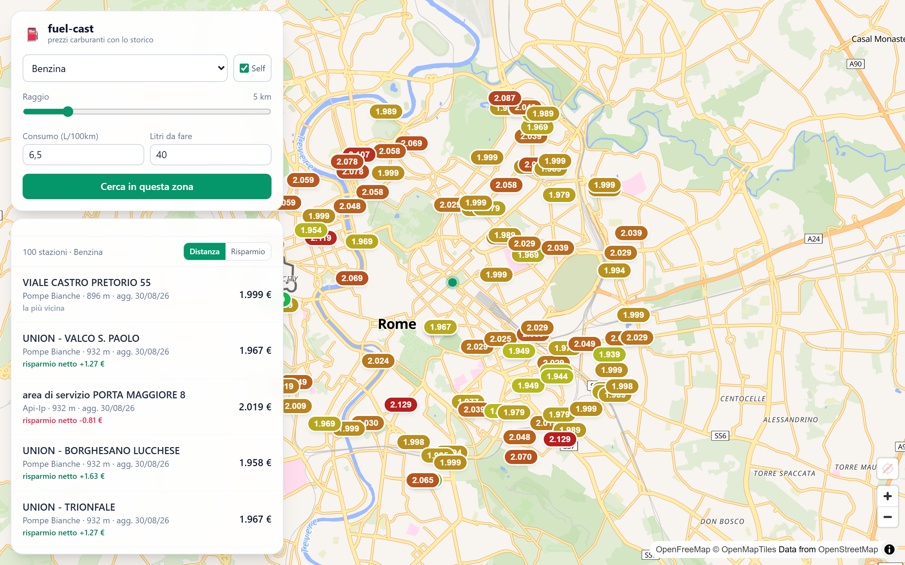
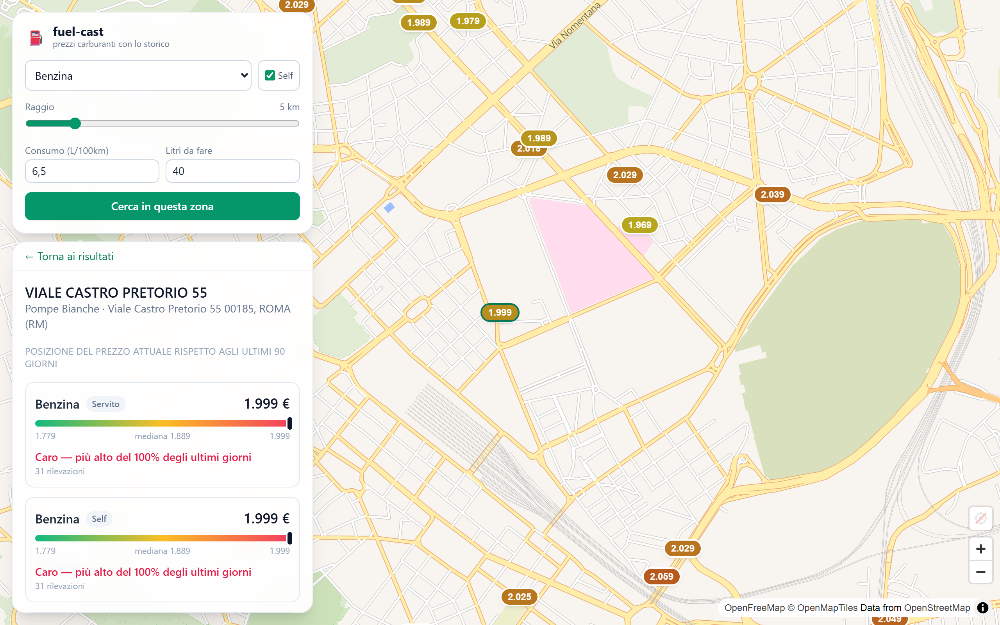
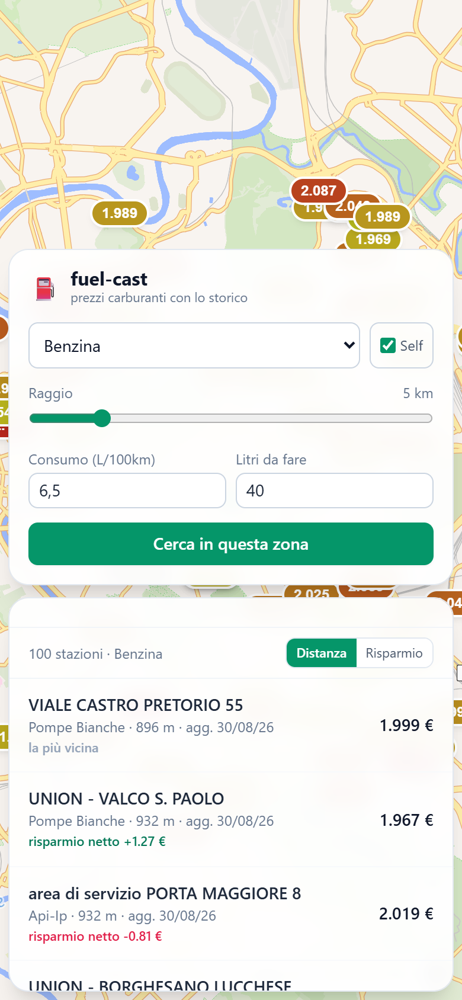

# fuel-cast

Italian fuel-price platform built on MIMIT open data. Its differentiator is
**history**: existing tools show only today's price — fuel-cast keeps the daily
series and turns it into signals ("pricier than 82% of the last 90 days",
"fill up now or wait?").

Two apps on one data layer:

- **Side A — consumer** (phase 1): find cheap fuel by radius/route, historical
  percentile per station, net-saving calculator.
- **Side B — station manager** (phase 2): local ranking, competitor price
  alerts, price-leadership analysis.

> Status: **Side A (consumer) feature-complete** — ETL + 2-year backfill,
> geo/history API, and the Angular PWA. Public deploy (Cloudflare Tunnel) is the
> last step; Side B is next. See the roadmap below.

## Screenshots

Consumer app: map with price-coloured stations, radius search, and net-saving
per station; station detail with the historical-percentile bar; responsive PWA.

| Explore (map + search + net saving) | Station detail (historical percentile) |
| --- | --- |
|  |  |

<p align="center"></p>

## Architecture (short)

Spring Boot (Java 21) + PostgreSQL/PostGIS. A daily, idempotent, self-healing ETL
downloads the MIMIT CSVs, archives the raw files (gzip) before parsing, and bulk-
loads them via JDBC. The raw archive plus idempotent loads make the history
resilient to bugs, reboots and outages. Full notes in [`docs/`](docs/):
[vision](docs/01-vision.md) · [architecture](docs/02-architecture.md) ·
[decision log](docs/03-decisions.md) · [deployment](docs/05-deployment.md).

## Run locally

Requires Docker.

```bash
cp .env.example .env   # adjust the password
docker compose up --build
```

This brings up PostGIS, the Spring backend, and the Angular PWA (Nginx). Then:

- **App UI:** <http://localhost:4200>
- **API health:** `curl http://localhost:8080/api/status`

### Frontend dev

```bash
cd frontend && npm install && npm start   # ng serve on :4200, proxies /api to :8080
```

Angular 19 (standalone) + Tailwind + **MapLibre GL** map (OpenFreeMap tiles, no
API key). Full-bleed map with floating search + results, and a station-detail
panel with the historical-percentile bar. Installable PWA.

`/api/status` reports how many stations and price observations are stored, the
latest snapshot date, how many distinct days of history are held, and the last
ingestion run — a live view of data freshness.

Consumer read API:

```bash
# Stations near a point selling a fuel, nearest first (radius/limit capped server-side)
curl "http://localhost:8080/api/stations/nearby?lat=41.9028&lon=12.4964&fuelType=Benzina&radiusMeters=5000"

# Station detail with historical percentile over a window (default 90 days)
curl "http://localhost:8080/api/stations/14017?windowDays=90"

# Distinct fuel types (for filter dropdowns)
curl "http://localhost:8080/api/fuel-types"

# Local price trend for the "fill up now or wait?" signal
curl "http://localhost:8080/api/trend/local?lat=41.9028&lon=12.4964&fuelType=Benzina&days=60"
```

Tests (need a Docker daemon; they spin up a real PostGIS container):

```bash
cd backend && mvn verify
```

## Data & licence

Source: **MIMIT** — *Carburanti: prezzi praticati e anagrafica degli impianti*,
licensed under **IODL 2.0** (free reuse with attribution).

- Dataset: <https://www.mimit.gov.it/it/open-data/elenco-dataset/carburanti-prezzi-praticati-e-anagrafica-degli-impianti>
- Historical archive: <https://www.mimit.gov.it/it/open-data/elenco-dataset/carburanti-archivio-prezzi>

Prices reflect the value **as of 8:00 the day before publication** (T-1), not
real-time.

## Roadmap

- [x] Daily idempotent ingestion + raw archive + `/api/status`
- [x] Historical backfill from the MIMIT quarterly archive (idempotent, range-scoped)
- [x] Geo API: stations within radius (PostGIS) + historical percentile per station
- [x] Angular PWA (Tailwind + MapLibre): map, radius search, station detail
- [x] Net-saving calculator (detour vs price diff) + "fill up now or wait?" local trend signal
- [ ] Public deploy behind Cloudflare Tunnel + automated DB backups
- [ ] Side B: station-manager dashboard
